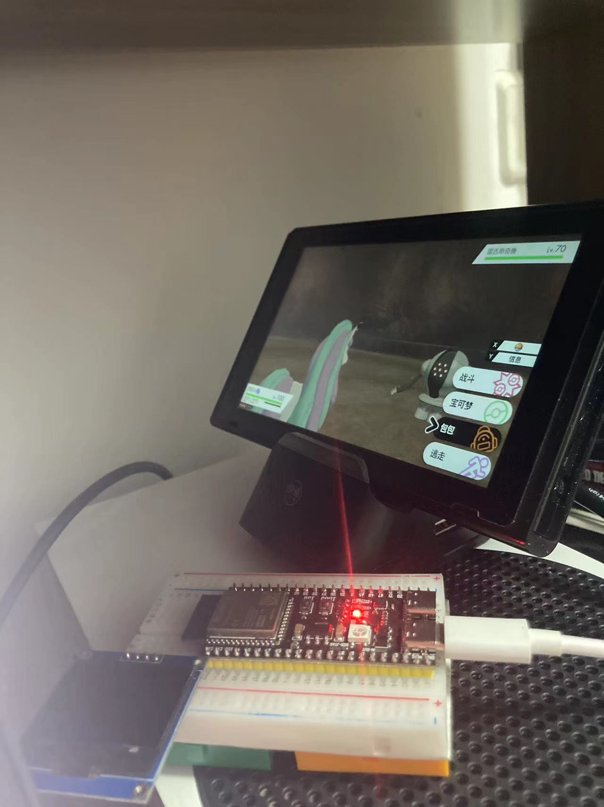
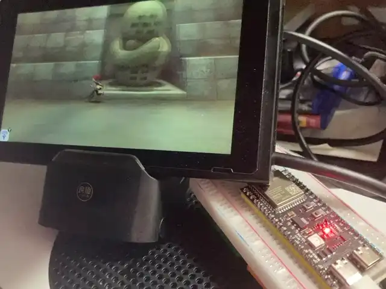

# esp32-circuitpython-switch-joystick

A virtual HID USB joystick created using ESP32S2/S3/RP2040

## 硬件需求

1. Switch主机 * 1
2. ESP32S2/ESP32S3/RP2040开发板 * 1
   - 本人测试用设备：
   - LOLIN S2 Mini：ESP32S2芯片，单核240MHz，N4R2    12.5元   <font color=red>注意近期有10%左右的网友无法刷入circuitpython官方固件，猜测可能是模块问题，如果担心设备问题，尽量选择Raspberry Pi Pico</font>
   - ESP32-S3-DevKitC-1-N16R8：ESP32S3芯片，双核240MHz，N16R8，支持蓝牙    59元
   - Raspberry Pi Pico (W): 带W版本 包含网络模块 51元，不带W 25元
   - 由于我希望降低大家的使用成本，后续的研发，测试，我将在LOLIN S2 Mini上进行
3. USB线（连接主机与开发板） * 1



## 常见问题汇总

[跳转](./SCRIPTS.md)

使用前请一定要看一下

## 功能

1. 模拟NS手柄，控制NS主机
2. 支持自定义宏脚本，实现游戏自动化
3. 内部集成部分宝可梦剑盾功能的宏脚本
4. TCP管理基本功能

## 预计追加功能

### 近期

1. ~~<font color=grey>LCD单色液晶显示支持（已废弃，计划采用WEB方式代替）</font>~~

2. ~~<font color=grey>实体按键支持（已废弃，计划采用WEB方式代替）</font>~~

3. Web管理（脚本的启动、停止、参数配置）

4. 远程管理功能（首选HTTP服务，其次TCP/UDP或MQTT，尽量不依赖其他服务器或客户端软件，独自实现远程管理功能）

### 计划

1. 通过NS的HDMI输出连接PC端，实现简单图像识别，增强脚本功能

2. **宝可梦朱紫脚本制作**

## 简介

### ESP32S3固件

#### 固件编译

##### 8.0.0-beta.4 ~

直接使用circuitpython官方固件即可，[固件下载链接](https://circuitpython.org/downloads)（<https://circuitpython.org/downloads>）。

##### 7.3.3

1. 设备OTG口连接PC，Windows与Mac都可

2. 如果设备为 **EPS32S3-N16R8** 或 **LOLIN S2 Mini**，可直接使用**项目中打包好固件**，不需要自行编译，直接进行固件写入操作

3. PC安装docker

4. 修改firmware/esp32s3-n16r8/Dockerfile文件：

   ```dockerfile
   WORKDIR /root/circuitpython/ports/espressif/boards
   # https://github.com/adafruit/circuitpython/tree/main/ports/espressif/boards/espressif_esp32s3_devkitc_1_n8r2
   RUN cp -r espressif_esp32s3_devkitc_1_n8r2 espressif_esp32s3_devkitc_1_n16r8 && \
    sed -i 's/ESP32-S3-DevKitC-1-N8R2/ESP32-S3-DevKitC-1-N16R8/g' espressif_esp32s3_devkitc_1_n16r8/mpconfigboard.h && \
    sed -i 's/USB_VID = 0x303A/USB_VID = 0x0F0D/g' espressif_esp32s3_devkitc_1_n16r8/mpconfigboard.mk && \
    sed -i 's/USB_PID = 0x7003/USB_PID = 0x00C1/g' espressif_esp32s3_devkitc_1_n16r8/mpconfigboard.mk && \
    sed -i 's/USB_PRODUCT = "ESP32-S3-DevKitC-1-N8R2"/USB_PRODUCT = "HORI CO.,LTD."/g' espressif_esp32s3_devkitc_1_n16r8/mpconfigboard.mk && \
    sed -i 's/USB_MANUFACTURER = "Espressif"/USB_MANUFACTURER = "HORIPAD S"/g' espressif_esp32s3_devkitc_1_n16r8/mpconfigboard.mk && \
    # CIRCUITPY_ESP_FLASH_MODE DIO -> QIO
    sed -i 's/dio/qio/g' espressif_esp32s3_devkitc_1_n16r8/mpconfigboard.mk && \
    # CIRCUITPY_ESP_FLASH_SIZE 8MB -> 16MB
    sed -i 's/8MB/16MB/g' espressif_esp32s3_devkitc_1_n16r8/mpconfigboard.mk && \
    echo 'CIRCUITPY_ESP32_CAMERA = 0' >> espressif_esp32s3_devkitc_1_n16r8/mpconfigboard.mk && \
    #  QUAD -> OCTAL
    sed -i 's/CONFIG_SPIRAM_MODE_QUAD/CONFIG_SPIRAM_MODE_OCT/g' espressif_esp32s3_devkitc_1_n16r8/sdkconfig && \
    # 2MB -> 8MB
    sed -i 's/2097152/8388608/g' espressif_esp32s3_devkitc_1_n16r8/sdkconfig
   ```

   由于官方固件不支持N16R8，所以在N8R2上进行修改。请修改时，参考自己的设备，根据自己设备信息修改。

   *注：VID与PID改为0x0F0D与0x00C1是依据模拟设备修改，不修改是否可以使用我没做尝试，还是尽量修改。*

5. 进入firmware/esp32s3-n16r8目录，运行下面脚本进行编译：

   ```shell
   docker build . -t circuitpython
   docker run -d --rm -v $(PWD)/build:/root/build circuitpython
   ```

   由于网络环境等因素问题，可能有些资源下载比较慢或经常中断，这个问题需要自行解决。

   等待很长一段时间后，编译完成，build目录会生成大量文件，保留firmware.bin或firmware.uf2文件即可（依据自己刷入固件的方式）

#### 固件写入

1. Chrome浏览器打开[ESP Web Flasher 页面](https://nabucasa.github.io/esp-web-flasher/)（<https://nabucasa.github.io/esp-web-flasher/>）刷写固件

2. ESP32进入固件写入模式（按住0或BOOT，点击RST，松开0或BOOT即可）

3. 页面操作，连接设备，**Baudrate**选择**460800 (LOLIN S2 Mini)** / **921600 (ESP32S3N16R8)**

4. 擦除设备，选择bin固件，同时把起始地址改为0x0，开始写入

5. 写入完成后双击设备上的RST按钮，或重新插拔设备即可

#### 程序部署

1. 修改src/resources/config.json中的wifi节点，type分为wifi和ap两种模式。

2. 把工作目录src下所有文件目录，拷贝至ESP32S3被识别出盘符即可，相同文件目录覆盖

3. 下载依赖库

   - 本地安装python，并且配置环境变量（python运行目录，pip下载包运行目录加入Path）。

   - 运行下面代码：

     本地安装circup：

     ```
     pip3 install circup
     ```

     esp32安装库：

     ```
     circup install asyncio adafruit-circuitpython-hid adafruit-circuitpython-ntp
     ```

<center><font color=red size=72>恭喜！环境部署成功！</font></center>

## 脚本语法

[跳转](./SCRIPTS.md)

## 配置文件

配置文件路径：ESP32目录/resources/config.json

## 远程管理

采用TCP方式进行管理，默认开启5000端口

### 运行效果




​        后续，删除游戏，并重新安装后，卡顿问题解决，对运行效率有需求的朋友可自行修改脚本。

​        更新OpenCV图像识别方式，效果如下：


#### 开发笔记（不定期更新）

[跳转](./NOTE.md)

#### 特别感谢

- 燃烧の小宇宙 提供朱紫无限复制道具（1.01版BUG)脚本
